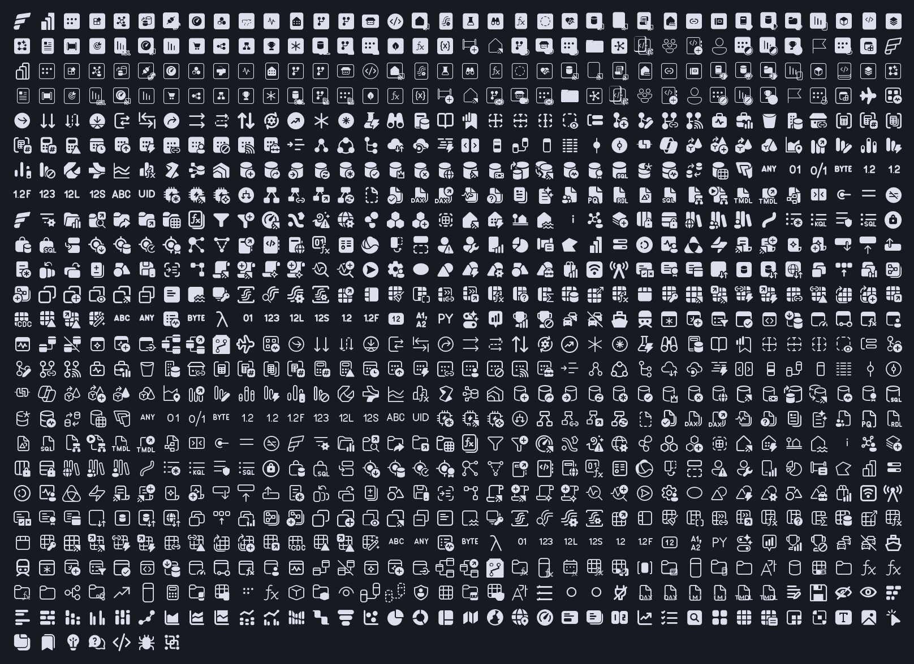

# fabric-nf

A NerdFont that provides glyphs of the Fabric icons for use in terminal user interfaces. Each glyph is based on the original icon, and not repackaging or redistributing those icons.

## Install

- **Linux:** copy `FabricSymbolsNF-Regular.ttf` to `~/.local/share/fonts/` and run `fc-cache -f`
- **macOS:** copy it to `~/Library/Fonts/`
- **Windows:** right-click it and choose Install for current user

Restart the terminal afterwards. The glyphs sit at `U+F2000`-`U+F282B`; most terminals fall back to the font for these codepoints by themselves.

## Sources

Original icon shapes are the intellectual property and Copyright (C) Microsoft Corporation: [`@fabric-msft/svg-icons`](https://www.npmjs.com/package/@fabric-msft/svg-icons), MIT; [Microsoft Fluent UI System Icons](https://github.com/microsoft/fluentui-system-icons), MIT.

Details and licence texts: [THIRD_PARTY_NOTICES.md](THIRD_PARTY_NOTICES.md).

## License

The font file is [MIT](LICENSE). The original icon artwork stays under its owners' terms, listed in [THIRD_PARTY_NOTICES.md](THIRD_PARTY_NOTICES.md). Microsoft, Microsoft Fabric and Power BI are trademarks of Microsoft Corporation; this font is not affiliated with or endorsed by Microsoft.
